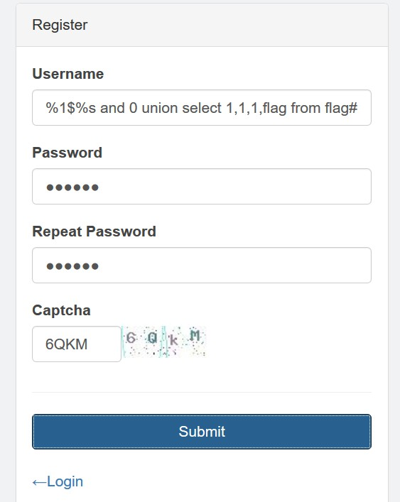
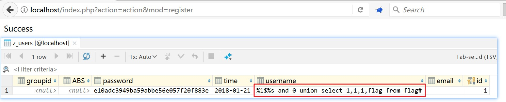
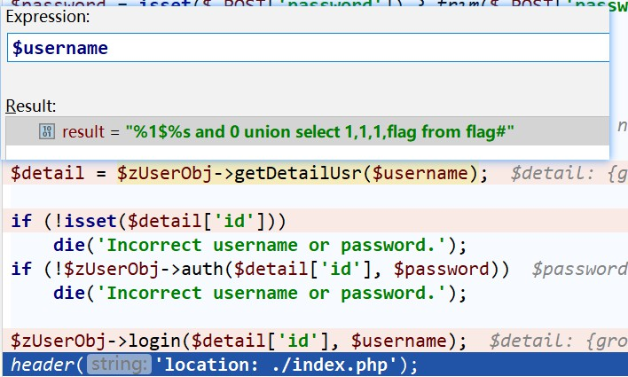
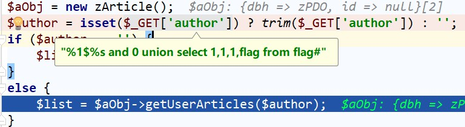
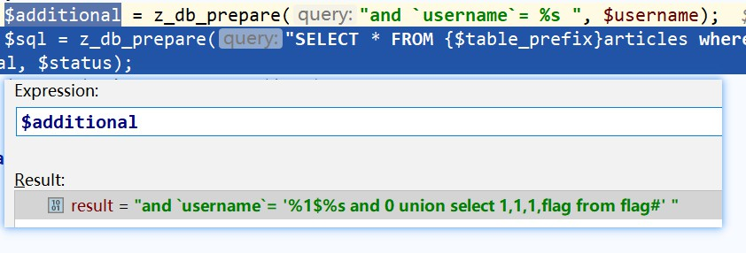
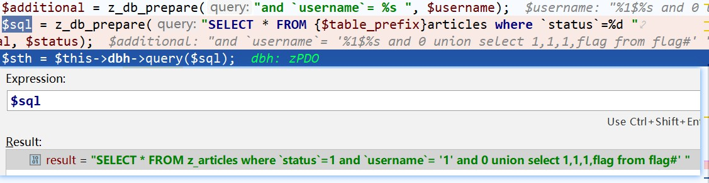
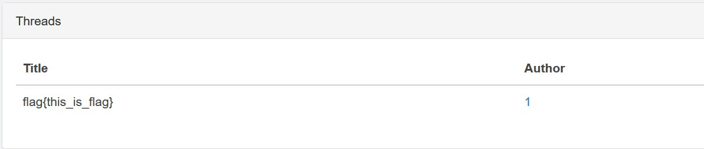

## 说明
本题目是来自于安恒12月赛的题目，主要是考察字符串格式化漏洞，参见[从WordPress SQLi谈PHP格式化字符串问题（2017.11.01更新）](https://paper.seebug.org/386/)

[题目](source/vscms/)

## writeup
## 说明
之前分析了PHP中的字符串格式化的问题以及wordpress中的字符串格式化漏洞，今天是以安恒的一道代码审计题目vscms的代码审计题目为例来进行说明。

## 程序分析
程序的功能非常的简单，用户能够进行正常注册和登录。登录之后能看到所有的文章。下面就对注册和登录的代码进行分析。

### 用户注册
`include/action/register.php`:
```PHP
if ($password != $password2 || strlen($username) > 50 || strlen($password) > 50)
    die('Error submission.');
$zUserObj = new zUser();
$detail = $zUserObj->getDetailUsr($username);
if (isset($detail['id']))
    die('Duplicate username');
header("Content-type:text/html;charset=utf-8");
if ($zUserObj->add($username, $email, $password)) {
    die('Success');
}
else {
    die('Failed');
}
```
对注册的用户名和密码仅仅只有长度的限制，这个对于payload来说，长度是完全可以的。之后进入到`$zUserObj->add($username, $email, $password)`。

`include/lib/class.zuser.php:add()`:
```PHP
function add($username, $email, $password) {
    global $table_prefix;
    $hash = md5($password);
    $username = trim($username);
    $email = trim($email);
    $time = get_time();
    try {
        $sql = z_db_prepare("INSERT INTO {$table_prefix}users(`username`,`email`,`password`,`time`) VALUES(%s, %s, %s, %s)", $username, $email, $hash, $time);
        $sth = $this->dbh->query($sql);
        if (!($sth->rowCount() > 0)) {
            return FALSE;
        }
        return TRUE;
    } catch (PDOExecption $e) {
        throw new Exception($e->getMessage());
    }
}
```
很常规的注册流程。其中有调用`z_db_prepare()`函数进行字符串格式化得到最终的SQL语句，进入到`z_db_prepare()`函数中:

```PHP
function z_db_prepare($query, $args) {
    if (is_null($query))
        return;
    // This is not meant to be foolproof -- but it will catch obviously incorrect usage.
    if (strpos($query, '%') === false) {
        die('The query argument of %s must have a placeholder.');
    }
    $args = func_get_args();
    array_shift($args);
    // If args were passed as an array (as in vsprintf), move them up
    if (isset($args[0]) && is_array($args[0]))
        $args = $args[0];
    $query = str_replace("'%s'", '%s', $query); // in case someone mistakenly already singlequoted it
    $query = str_replace('"%s"', '%s', $query); // doublequote unquoting
    $query = preg_replace('|(?<!%)%f|', '%F', $query); // Force floats to be locale unaware
    $query = preg_replace('|(?<!%)%s|', "'%s'", $query); // quote the strings, avoiding escaped strings like %%s
    array_walk($args, 'myaddslashes');
    return @vsprintf($query, $args);
}
```
其中的字符格式化代码的方法是之前典型的存在字符串格式化漏洞的代码。但是通过我们之前的两次分析，我们需要两次调用格式化漏洞的函数，才能够逃脱我们的payload。但是目前只有一次调用显然是无法利用成功的。

分析完毕注册功能之后，我们进行分析程序的登录功能

### 用户登录
用户登录的后台逻辑处理代码：`include/action/login.php`
```PHP
$username = isset($_POST['username']) ? trim($_POST['username']) : '';
$password = isset($_POST['password']) ? trim($_POST['password']) : '';
if ($username == '' || $password == '')
    die('Imcomplete submission.');
$zUserObj = new zUser();
$detail = $zUserObj->getDetailUsr($username);
if (!isset($detail['id']))
    die('Incorrect username or password.');
if (!$zUserObj->auth($detail['id'], $password))
    die('Incorrect username or password.');
$zUserObj->login($detail['id'], $username);
header('location: ./index.php');
```
对用户输入的用户名和密码进行校验，校验成功之后跳转到`index.php`。整个登录的校验逻辑是:
1. `$detail = $zUserObj->getDetailUsr($username);`，判断是否存在此用户名，如果不存在则直接返回`Incorrect username or password.`
2. `$zUserObj->auth($detail['id'], $password)`，校验用户输入的用户名和密码是否正确。如果不正确，返回`Incorrect username or password.`
3. 如果校验成功之后，调用`$zUserObj->login($detail['id'], $username`，保存用户的登录状态。

我们首先分析校验用户名的函数,`$detail = $zUserObj->getDetailUsr($username);`。
`include/lib/class.zuser.php:getDetailUsr()`
```PHP
public function getDetailUsr($username) {
    global $table_prefix;
    $username = trim($username);
    try {
        $sql = z_db_prepare("SELECT * FROM {$table_prefix}users WHERE `username` = %s", $username);
        $sth = $this->dbh->query($sql);
        $result = $sth->fetch(PDO::FETCH_ASSOC);
        return $result;
    } catch (PDOExecption $e) {
        throw new Exception($e->getMessage());
    }
}
```
这个地方也只是进行了一次字符串格式化，那么在这个地方也不会存在这种的漏洞。通过继续对`auth($detail['id'], $password)`和`login($detail['id'], $username)`的分析都不存在这样的漏洞。

### 获取文章
我们继续对获取文章的代码进行分析，`include/view/index.php`
```PHP
$aObj = new zArticle();
$author = isset($_GET['author']) ? trim($_GET['author']) : '';
if ($author == '') {
    $list = $aObj->getAll();
}
else {
    $list = $aObj->getUserArticles($author);
}
// some php code
/**
*foreach ($list as $item) {
*   echo esc_html($item['title']);
*   echo esc_html($item['username']); 
*}
*/
```
分析获取文章的代码`$list = $aObj->getUserArticles($author);`.

`include/lib/class.zarticle.php:getUserArticles()`
```PHP
public function getUserArticles($username) {
    global $table_prefix;
    $username = trim($username);
    $status = isset($_GET['status'])?trim($_GET['status']):1;
    try {
        $uObj = new zUser;
        $udetail = $uObj->getDetailUsr($username);
        if(!isset($udetail['id'])){
            return false;
        }
        $additional = z_db_prepare("and `username`= %s ", $username);
        $sql = z_db_prepare("SELECT * FROM {$table_prefix}articles where `status`=%d ".$additional, $status);
        $sth = $this->dbh->query($sql);
        $result = $sth->fetchAll(PDO::FETCH_ASSOC);
        return $result;
    } catch (PDOExecption $e) {
        throw new Exception($e->getMessage());
    }
}
```
其中刚好存在两次字符串格式化的问题。分别是：
1. `$additional = z_db_prepare("and 'username'= %s ", $username);`，利用`$username`得到`$additional`
2. `$sql = z_db_prepare("SELECT * FROM {$table_prefix}articles where `status`=%d ".$additional, $status);`通过`$additional`得到最后的`$sql`

通过分析`$username`经过了两次字符串格式化，那么最终的漏洞的突破点就是在`$username`。而`username`又是通过`$_GET['author']`得到的，那么一切的关键就是在于利用`author`注入我们的payload。但是其中还存在一处代码：
```PHP
$udetail = $uObj->getDetailUsr($username);
if(!isset($udetail['id'])){
    return false;
}
```
我们注入的payload必须是之前已经存在的用户名。

## 突破点
对整个代码进行重新的数理：
1. 由于`$username`是由用户进行注册输入的，同时对注册的用户名的显示也只是长度不能唱过50个字符。**所以`$username`是我们可控的。**
2. 漏洞的触发点是需要用户进行登录，程序对输入的用户名没有进行任何的过滤。所以在正常登录之后，我们需要通过参数`$_GET['author']`所传入我们的payload，但是我们的传入的`$_GET['author']`必须是我们已知的用户，所以我们需要先将我们的payload以用户名的方式注入。

## 漏洞利用
注册用户传入我们的payload，用户名为`%1$%s and 0 union select 1,1,1,flag from flag#`



注册成功，数据库中成功第插入了我们的payload。




以`%1$%s and 0 union select 1,1,1,flag from flag#`作为用户名进行登录。由于之前已经注册成功，所以能够通过验证，之后进入到`index.php`中获取文章内容。




我们需要通过`author`传入我们的payload。
`index.php?action=view&mod=index&1516529444&author=%251%24%25s%20and%200%20union%20select%201%2C1%2C1%2Cflag%20from%20flag%23`



执行完`$additional = z_db_prepare("and 'username'= %s ", $username);`,我们得到`$additional `是`and 'username'= '%1$%s and 0 union select 1,1,1,flag from flag#'`



执行完`$sql = z_db_prepare(..)`，我们得到的SQL语句是`SELECT * FROM z_articles where 'status'=1 and 'username'= '1' and 0 union select 1,1,1,flag from flag#' `，这样就存在SQL注入了，我们最终就得到了payload。



页面上显示flag：



## 总结
总的来说，这是一道考察PHP字符串格式化漏洞非常好的一套代码。通过这道代码能够加强对此类漏洞的理解。