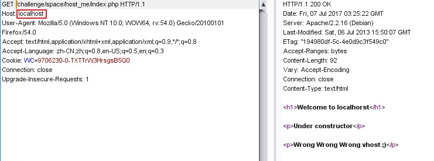
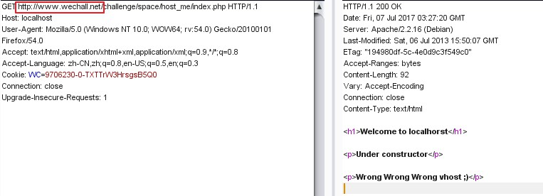
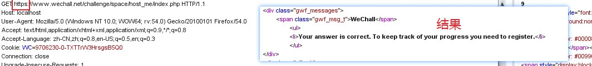

### Problem description
Fun Fact: There is even a virtualhost named localhost, which probably does not make it easier.
It seems like we need to reinstall the box, unless you can access this page with the correct constraints.

### Code
```PHP
<?php
 
$challenge = function()
{
        return $_SERVER['HTTP_HOST'] === 'localhost';
}
 
?>
```

### solution
这道题目看似难度很高，但实则很简单，只需要对HTTP的请求头和常见的虚拟主机的配置有所了解就可以解决问题。

#### 尝试直接修改host

错误，题目中已经说明这个虚拟主机的名称是叫做localhost。直接将host修改为localhost，则会请求到虚拟主机上面

#### 修改GET请求

为什么修改之后还是失败?后来想到这个网站部署的是https，所以应该提交https的请求

#### 修改GET请求为https
