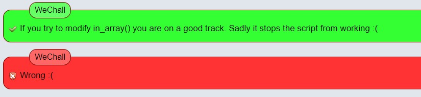
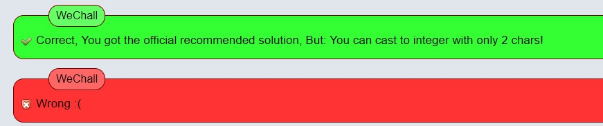

### Problem description
I have this script and its prone to sql injection.
Your mission is to provide me with a fix.
The solution is the fix with the least effort (The shortest way to fix at some logic position), and guarantee the script does still work.
if you think "urldecode()" will fix the script you simply enter it as solution.
The solution has to contain all chars that you need to type.
Feel Free to discuss it in the forums, its kinda training challenge :)

### Code
```PHP
<?php
# Only allow these ID's
$whitelist = array(1, 2, 3);

# if show is not set die with error.
if (false === ($show = isset($_GET['show']) ? $_GET['show'] : false)) {
    die('MISSING PARAMETER; USE foo.bar?show=[1-3]');
}
# check if get var is sane (is it in whitelist ?)
elseif (in_array($show, $whitelist))
{
    $query = "SELECT 1 FROM `table` WHERE `id`=$show";
    echo 'Query: '.htmlspecialchars($query, ENT_QUOTES).'<br/>';
    die('SHOWING NUMBER '.htmlspecialchars($show, ENT_QUOTES));
}
else # Not in whitelist !
{
    die('HACKER NONONO');
}
?>
```

### Solution
#### in_array
很明显是一道typecasting的题目，show变量没有强制转换为int类型。我认为最好的答案是：
```
in_array($show, $whitelist,true)
```
使用强制模式，就会检查$show类型$whitelist中的item的类型是否一直，但是给出的答案是：

不懂为什么不是正解

#### intval(),(int)
使用这两个函数将$show进行转换，最终的解答还是存在问题


#### final cast
题目最终的要求表示使用2个字符就可以完成转换，最终的答案就是
```PHP
-0
```
